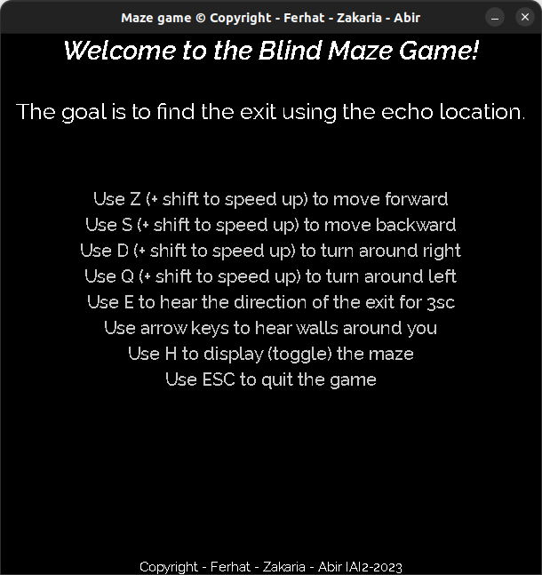
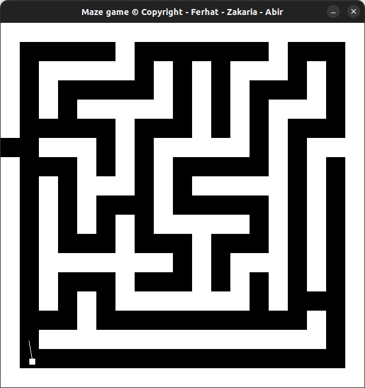

# Blind Maze game with ```Echo Location``` hearing

<div style="text-align: center">
    
    
</div>

# Introduction

<div style="text-align: justify">
This is an immersive 2D blind maze game where your objective is to find the exit without visual cues. As you progress through the challenging maze, your journey will lead you to a special encounter at the end. There, you'll have the incredible opportunity to meet a renowned guitarist who will gladly sign an autograph just for you. The game relies solely on auditory feedback, with the sound of your footsteps and the surrounding walls guiding your way. Developed using the C programming language, this game leverages the power of SDL2, SDL2_ttf, OpenAL, and ALUT libraries to create a captivating gaming experience.</div>
</br>

# Installation
* Run ```make install``` to install the dependencies
# Usage
* Execute ```./maze``` or type ```make run``` to open the game
* Use Z and S keys to move farward and back
* Use D and Q keys to turn the direction of player around
* Use H key to show or hide the maze
* Use ESC key to quit the game
# Compilation
* Run ```make``` to compile with ```gcc -Wall -Wextra -pedantic ./src/*.c -o maze -lopenal -lalut -lm -lpthread -ldl  `sdl2-config --cflags` `sdl2-config --libs` -I/usr/include/SDL2 -L/usr/lib/x86_64-linux-gnu -lSDL2_ttf; ```.
* Run ```make clean``` to delete the object files.

# Authors
Ferhat SAIDOUN  
Zakaria Raji                                           
Abir Hsaine
